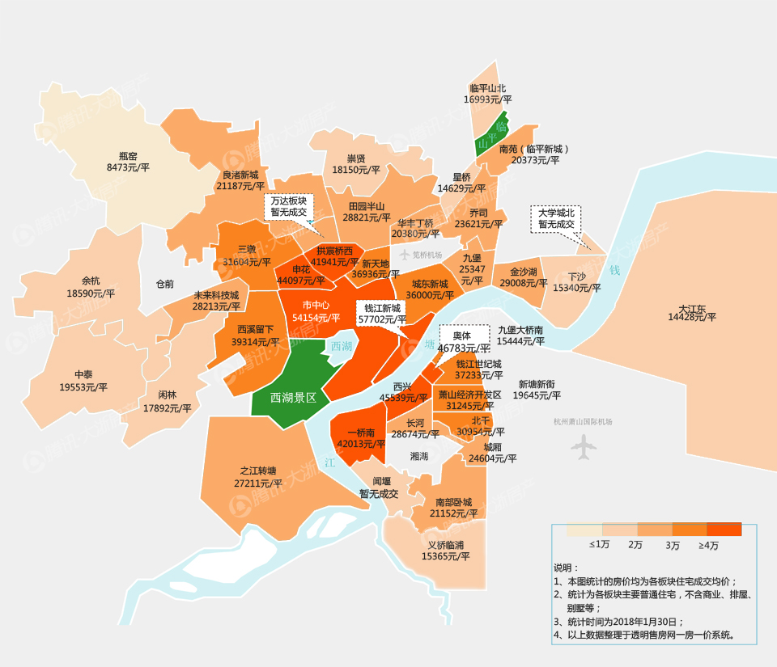
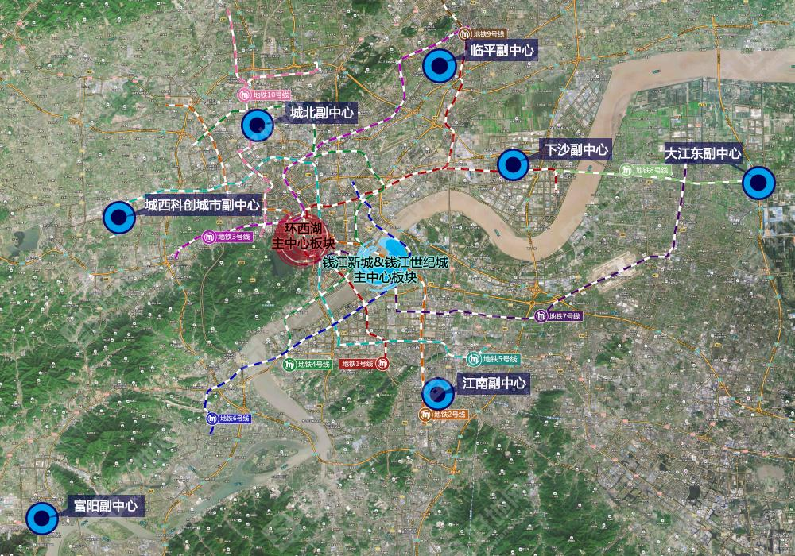

								杭州房产分享

              -- 图片来自网络，如有侵权删除
              -- 多年研究，持续更新

*   [一：杭州规划](#杭州规划)
    *   [1.杭州市区土地级别划分图](#杭州市区土地级别划分图)
    *   [2.杭州楼市板块房价地图](#杭州楼市板块房价地图)
    *   [3.杭州城市多中心发展图](#杭州城市多中心发展图)
  

## <a name="杭州规划">一：杭州规划</a>

### 1.杭州市区土地级别划分图（杭政函[2004]129号)

杭州是一座具有深厚历史底蕴的城市，越是历史底蕴深厚的城市，其市中心的变迁越为漫长，2004年的图到现在看来也是基本符合。

### 2.杭州楼市板块房价地图（2018年1月)

### 2.杭州城市多中心发展图（2018年1月)

    环西湖主中心板块
覆盖中河路以西、环城北路—天目山路以南、河坊街以北的环西湖地区，包括庆春—凤起板块、武林板块、湖滨板块、吴山板块和黄龙板块。
发展定位为市级休闲游憩商业核心区（RBD），重点发展商贸流通、文化娱乐和休闲旅游等产业，展示杭州历史文化气质和国际化形象。

    钱江新城和钱江世纪城主中心板块
由钱江新城和钱江世纪城两个区域组成。
发展定位为杭州市的政治、经济、文化新中心和钱塘江金融港湾核心区。

    江南副中心
由滨江区、萧山城区和江南临江区块组成。打造以高新研发、商业商务和居住为主导的现代化智慧城区和远景商务中心。
滨江区围绕发展高科技、实现产业化、建设科技新城，着力营造创业生态，建设智慧e谷，打造创新创业高地，建设国家自主创新示范区核心区。
萧山城区重点发展金融服务、科技服务、研发总部、工业设计、信息软件、会展旅游等高端业态。

    下沙副中心
以杭州经济开发区和高教园区为骨干区域。
以高新技术产业和先进制造业为基础，打造集教育、科研、商务和居住等功能于一体的复合型楼宇经济示范区。

    临平副中心
由临平新城、钱江科技城、九乔商贸城、塘栖新城、崇贤新城以及老城区等板块组成。
发展定位为融总部商务、商业金融、文化展示、旅游休闲和高端居住等于一体的生态智慧型楼宇经济示范区。

    大江东副中心
由江东新城、临江新城、空港新城和前进工业园区四大片组成。
大力发展智能制造业、现代服务业等高技术产业，打造以先进制造业为主导的都市工业型楼宇经济示范区。

    城西科创城市副中心
以未来科技城和青山湖科技城为核心。
重点发展信息经济、生物医药、新材料、科创服务和文化创意等产业。辐射临安东部、余杭西部等区域。

    城北副中心
以勾庄一带为核心，由运河新城、北部新城核心区组成，主要依托北部软件园等高新技术产业发展现代服务业。
以商业、商务和文化为主导功能，打造集生活居住、商务办公、商贸物流、旅游休闲、文化创意、总部经济为一体。辐射良渚组团、瓶窑组团的城市北部楼宇经济示范区。

    富阳副中心
以鹿山新城、银湖新城等为重点区块。
大力发展文化创意、科技研发、金融服务、信息技术和总部经济等，打造杭州西部总部楼宇经济示范区。

